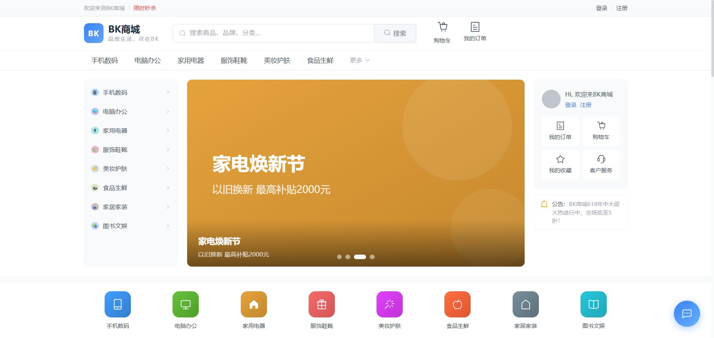
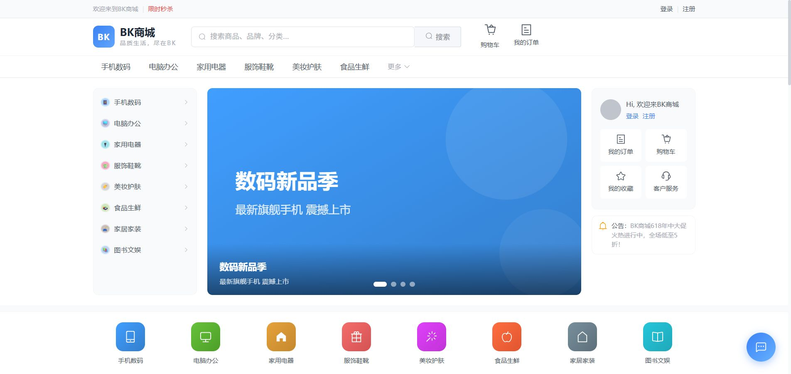

<div align="center">

# 🛍️ BK 商城

> **Spring Cloud Alibaba + Dubbo 3 微服务电商平台** —— 前端 Vue3，后端 22 个微服务模块

[](https://spring.io/projects/spring-boot)
[](https://dubbo.apache.org/)
[](https://vuejs.org/)
[](https://vitejs.dev/)
[](#)

一个用于学习和实践的全栈电商平台，覆盖**商品、搜索、购物车、订单、秒杀、支付、AI 客服、个人中心**等完整业务链路。

</div>

---
## 📸 界面预览

> 截图存放在 [`screenshots/`](screenshots/) 目录，使用**相对路径**引用，随仓库一起提交即可正常显示。

<table>
  <tr>
    <td align="center"><br/><sub>首页 Banner</sub></td>
    <td align="center"><br/><sub>首页顶部</sub></td>
  </tr>
</table>

<!-- 更多截图占位：将新截图放入 screenshots/ 目录后，在下方表格补充即可
  <tr>
    <td align="center"><br/><sub>商品详情</sub></td>
    <td align="center"><br/><sub>购物车</sub></td>
  </tr>
  <tr>
    <td align="center"><br/><sub>订单确认</sub></td>
    <td align="center"><br/><sub>限时秒杀</sub></td>
  </tr>
-->

---

## ✨ 功能特性

**前台（bk-mall-web）**

- 🏠 首页：轮播 Banner、分类导航、快捷入口、限时秒杀、猜你喜欢推荐
- 🔍 商品搜索：关键词搜索、自动补全、分类/品牌/价格/排序筛选
- 📦 商品详情：多图展示、SKU/规格、加入购物车、立即购买
- 🛒 购物车：增删改、勾选结算、价格联动
- 📋 订单：下单确认、收货地址管理（省市区三级联动）、订单列表/详情
- ⚡ 秒杀：倒计时、限时抢购、秒杀进度
- 🤖 AI 客服：通义千问大模型 + FAQ 向量检索（敏感词过滤）
- 👤 个人中心：资料展示编辑、头像（emoji 预设）、收货地址管理

**后台 / 服务**

- 微服务架构：接口层（customer_api）+ 业务服务层（service）分层
- 用户：邮箱验证码注册登录、密码加密
- 订单：RocketMQ 延时消息订单超时检查
- 搜索：Elasticsearch 商品索引与同步
- 文件：FastDFS 图片上传

---

## 🧱 技术栈

| 层 | 技术 |
|---|---|
| 前端 | Vue 3 + Vite 5 + Element Plus + Pinia |
| 微服务框架 | Spring Boot 3.5 + Spring Cloud Alibaba + **Dubbo 3.3** |
| 注册/配置中心 | **Nacos**（服务端集群化部署） |
| 数据库 | MySQL 8（库 `baizhanshopping`，表前缀 `bz_`）+ MyBatis-Plus |
| 搜索引擎 | Elasticsearch 8.4（商品搜索/推荐） |
| 缓存 | Redis（购物车/秒杀/验证码） |
| 消息队列 | RocketMQ 5.3（订单超时检查等） |
| 向量库 | Qdrant（AI 客服 FAQ 检索） |
| 文件存储 | FastDFS（商品图片） |
| AI | 阿里云 DashScope（通义千问 qwen-max + text-embedding-v2） |

---

## 🏗️ 模块说明

### 前端

| 模块 | 端口 | 说明 |
|---|---|---|
| **bk-mall-web** | 3000 | 电商前台（Vue3+Vite）：首页/搜索/商品详情/购物车/订单/秒杀/AI客服/个人中心 |

### 接口层（customer_api，HTTP 接口 + Dubbo Consumer）

| 模块 | 端口 | 说明 |
|---|---|---|
| **user_customer_api** | 8003 | 用户接口：登录/注册/邮箱验证码 |
| **cart_customer_api** | 8005 | 购物车接口：列表/加购/改数量/删除 |
| **order_customer_api** | 8006 | 订单接口：下单/订单列表/收货地址/支付 |
| **custcare_customer_api** | 8010 | AI 客服接口 |
| **gg_customer_api** | 8008 | 分类/品牌/商品类型接口 |

### 业务服务层（service，Dubbo Provider）

| 模块 | 端口 | 说明 |
|---|---|---|
| **user_service** | 9006 | 用户服务：注册/登录逻辑、密码加密 |
| **cart_service** | 9009 | 购物车服务 |
| **order_service** | 9010 | 订单服务：下单、订单管理、超时检查（RocketMQ 延时消息） |
| **goods_service** | 9013 | 商品服务：商品 CRUD、商品详情（品牌/分类/图片/规格） |
| **search_service** | 9008 | 搜索服务：ES 商品搜索、数据同步 |
| **seckill_service** | 9005 | 秒杀服务：秒杀商品 Redis 管理、抢购、秒杀订单 |
| **gg_service** | 9004 | 广告/横幅分类服务 |
| **custcare_service** | 9015 | AI 客服服务：敏感词过滤、FAQ 向量检索、大模型对话 |
| **mail_service** | 9011 | 邮件服务：发送验证码邮件 |
| **message_service** | 9007 | 消息服务 |
| **file_service** | 8002 | 文件服务：FastDFS 图片上传 |
| **admin_service** | 9002 | 管理后台服务 |


### 管理端 / 公共

| 模块 | 端口 | 说明 |
|---|---|---|
| **manager-api** | 8001 | 管理后台接口 |
| **message_api** | - | 消息接口 |
| **common** | - | 公共模块：POJO 实体、Dubbo 接口定义、工具类 |

---

## 📂 目录结构

```text
shopping/
├── bk-mall-web/            # 电商前台（Vue3 + Vite）
├── bk-mall-admin/          # 管理后台前端（Vue3 + Vite）
├── common/                 # 公共模块（POJO / Dubbo 接口 / 工具）
├── admin_service/          # 管理后台服务
├── manager-api/            # 管理后台接口
├── *-customer_api/         # 接口层（HTTP + Dubbo Consumer）
├── *-service/              # 业务服务层（Dubbo Provider）
└── screenshots/            # README 截图
```

---

## 🚀 部署与运行

### 前置依赖

本项目为完整微服务电商架构，需提前部署并配置以下基础设施：

| 服务 | 说明 |
|---|---|
| Nacos | Spring Cloud Alibaba 注册与配置中心 |
| MySQL | 主数据库（需提前创建 `baizhanshopping` 库并导入 SQL） |
| Redis | 缓存服务（购物车、秒杀库存、验证码缓存等） |
| Elasticsearch | 商品全文搜索 |
| RocketMQ | 消息队列（订单超时检测等异步场景） |
| Qdrant | 向量数据库（AI 客服 FAQ 语义检索） |
| FastDFS | 分布式文件存储（商品图片上传） |

> 各服务配置（数据源地址、账号密钥、AI API Key 等）均通过 Nacos 配置中心统一管理，**配置不存放在 GitHub**。

### 本地开发启动

1. 在 IDEA 中按依赖顺序启动各 Spring Boot 服务（`common` 为公共依赖，无需启动）
2. 启动前端开发服务器：
```bash
cd bk-mall-web
npm install
npm run dev
```

### 生产部署

后端服务打包后使用 Docker / Kubernetes 编排部署，前端打包后托管至静态资源服务或 CDN，域名反代后即可公网访问。

---

## 🔌 端口速查

- 前端：**3000**
- 接口层（customer_api）：8003 / 8005 / 8006 / 8008 / 8010
- 业务服务（service）：8002 / 9002 / 9004 / 9005 / 9006 / 9007 / 9008 / 9009 / 9010 / 9011 / 9013 / 9015
- 管理端：8001

---

## 📄 License

本项目仅供学习与个人实践使用。
